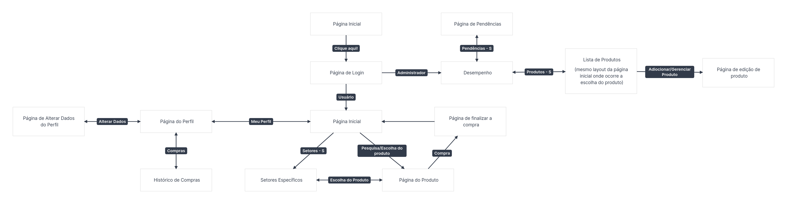

# Trabalho-web

Membros do Grupo:
- Davi Gabriel Domingues (15447497)
- Giovanna Nascimento Noventa (15637210)
- Pedro Martins Oliveira (13696213)

Uma loja online de produtos eletrônicos

---
# Requisitos

## Mapa de Navegação


## Funcionalidade do Programa
Dividindo o programa na parte do cliente e do administrador da loja precisamos que cada um tenha as seguintes funcionalidades

### Parte do Cliente
Uma [página inicial](Page-Initial/página_de_apresentação) para recepcionar o usuário com algumas informações básicas sobre o site e alguns dos associados

A [página de login](Page-Initial/página_de_login), onde o usuário utilizando um login e uma senha pode entrar na sua conta

```
Falta o negócio de criar conta e esqueci a senha
```

```
Não achei a página inicial, com os produtos recomendados e tals
```

Ao pesquisar