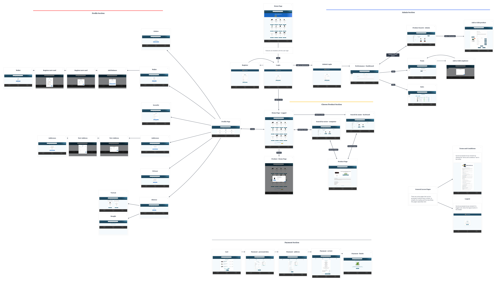

# Trabalho-web

Membros do Grupo:
- Davi Gabriel Domingues (15447497)
- Giovanna Nascimento Noventa (15637210)
- Pedro Martins Oliveira (13696213)

Uma loja online de produtos eletrônicos

---
# Mapa de Navegação

Para ter uma visão melhor acesse o [projeto no milanote clicando aqui](https://app.milanote.com/1TWIzG1gYJgXeW?p=rvOTCrnhBY9).

# Mockups das Páginas
Os mockups das páginas podem ser encontrados no mapa de navegação ou na pasta [Pages-screenshots](Pages-screenshots/).

Segue também [nosso link do figma](https://www.figma.com/design/8Pk9ykizcWYiU7RxIeDDsV/Design-Principal?node-id=33-2&t=8IoWAMFarDPiJcpR-1) com alguns dos mockups, contudo alguns deles não estão atualizados, as versões mais atuais estão no mapa e na pasta citados anteriormente.

# Requisitos

## Funcionalidade do Programa
Dividindo o programa na parte do cliente e do administrador da loja precisamos que cada um tenha as seguintes funcionalidades:

### Parte do Cliente

A [página inicial](eletrocurte-se/src/pages/PaginaInicial.jsx), onde o usuário se depara com alguns produtos e o layout de e-commerce de produtos eletrônicos, sendo necessário um login acompanhado de senha, de username e de email para entrar na sua conta ou para se cadastrar

Após o cadastro, o usuário pode entrar na página do seu perfil, de onde ele pode alterar informações, acessar as últimas compras, ver os últimos produtos entre outras funções (exemplo, adicionar saldo na carteira, para cada cartão associado), pode acessar o modal dos produtos, contendo algumas descrições dele, comprar produtos, adicionar no carrinho de compras e executar compras.

Além disso, o usuário pode procurar por um produto para comprar, tendo então algumas opções para procurar esse produto, ele pode procurar pelo nome ou pelo setor específico associado, como forma de busca dinâmica.

Ao escolher um produto o usuário consegue acessar a [página específica desse produto](eletrocurte-se/src/pages/PaginaSetor.jsx) e pode ainda prosseguir para a compra na [página de compra](eletrocurte-se/src/pages/PaginaProduto.jsx).

### Parte do Administrador
Caso o usuário entre como um administrador ele será levado para a [página incial da administração](eletrocurte-se/src/pages/Desempenho.jsx), onde ele tem acesso a informações gerais sobre as vendas.

Na página incial o administrador também pode acessar os produtos onde ele consegue adicionar, remover e alterar os produtos anunciados.

Por fim, o administrador pode entrar nas [pendências](eletrocurte-se/src/pages/Pendencias.jsx) onde ele consegue ver perguntas, reclamações, envios pendentes e outras atividades que devem ser feitas.

## Estruturação do HTML, do CSS e do JS (React imbutido)
A estruturação das páginas foi feita com HTML5 para compor os elementos básicos. Com a estrutura feita, bastou se basear nos mockups para adicionar as regras de CSS aos elementos. Em seguida, foi adaptada a [primeira versão do projeto](Old-Version) para compor a estrutura geral componentizada do React, a partir do uso de arquivos .jsx, além da inserção das propriedades associadas (como bibliotecas React e props) para dar responsividade ao site, além de embasar a futura robustez no tratamento dos dados via banco de dados NoSQL (MongoDB), para o Milestone 3.

# Descrição do Projeto
O projeto consiste de um website para a venda de produtos eletrônicos de uma loja fictícia chamada **Eletrocurte-se**.

Há três partes gerais ([legado do Milestone 1](Old-Version)), uma de acesso geral, uma do perfil e uma de acesso apenas para administradores da loja.

A página de acesso geral é onde os usuários procuram por produtos para comprar.

A página do perfil é onde os usuários podem verificar os históricos relacionados às interações com os produtos do site (visualização e compras), os dados pessoais, as mensagens do sistema e/ou do administrador, além de várias outras opções disponíveis.

A página dos administradores é onde os donos da loja podem não apenas controlar os produtos disponíveis para venda (adicionar, remover ou alterar) como também ver estatísticas sobre as vendas, responder perguntas e reclamações de usuários, verificar quais produtos esperam para serem enviados entre outras funcionalidades.

Mesmo que a estrutura básica não seja mais a mesma necessariamente, a lógica de divisão utilizada para o desenvolvimento, assim como para a divisão do trabalho a das partes gerais é parecida. Entretanto, a partir do Milestone 2, houve a necessidade de enriquecer a aplicação com componentes e bibliotecas de framework para adequar as páginas aos critérios de desenvolvimento da disciplina de Introdução ao Desenvolvimento Web.

# Comentários do código

O aplicativo web usou o ambiente do React para desenvolver os arquivos e as funcionalidades. Os comentários dos códigos se encontram neles mesmos, na [pasta do projeto](eletrocurte-se), onde ela contém os [dados "públicos" utilizados](eletrocurte-se/public), os [componentes desenvolvidos](eletrocurte-se/src/components), as [páginas de layout](eletrocurte-se/src/styles) e as [páginas em si].

Lá, cada página terá a sua explicação das funcionalidades associadas, o seu uso, a sua estruturação e o seu funcionamento adequados para o site

# Resultados de testes

# Usando React

Esse projeto foi inicializado com [Create React App](https://github.com/facebook/create-react-app).

## Clonagem de repositório

Para utilizar suas dependências, é necessário cloná-lo do GitHub:
### `git clone https://github.com/Pedropudin/Trabalho-web.git`

## Comandos disponíveis

Primeiro, no terminal, execute "cd eletrocurte-se". Daí, no diretório do projeto, você pode rodar: 

### `npm install`

Instala todas as dependências do aplicativo, para torná-lo utilizável

### `npm start`

Roda a aplicação no modo de desenvolvimento, com todas as bibliotecas presentes e suportadas pelo React e que foram utilizadas para este trabalho.
Abra [http://localhost:3000](http://localhost:3000) no seu navegador para ve-la, após a compilação do App no terminal.

# Problemas

Apesar de termos mantido a política de desenvolvimento de muitos arquivos e de priorizar componentização ao máximo, como é possível ver na [pasta de componentes do projeto](eletrocurte-se/src/components/), acabamos por lidar com uma certa dificuldade em migrar muitas das ideias originais presentes no Mockup do Figma, assim como manter, de certa forma, o layout original do site, considerando as adaptações existentes para o modelo React. Além disso, encontramos certa dificuldade em modularizar 100% os estilos CSS utilizados no [Milestone 1](Old-Version/), já que foram bastantes arquivos, assim como o projeto nos exigiu criar diversos estilos CSS para as várias dependências do projeto ([acesso](eletrocurte-se/src/styles/)). Dessa forma, o tempo de desenvolvimento para o projeto foi bem mais elevado do que o esperado, já que se tinha uma grande árvore de dependências entre arquivos para se desenvolver em um prazo mais curto, comparado ao primeiro Milestone.

# Comentários
O Milestone 3 servirá para sacramentar o trabalho, a fim de alinhá-lo à lógica imbutida com banco de dados para a robustez do site e, por fim, do aprendizado prático da disciplina. Ademais, a migração de certas lógicas para o back-end poderá nos servir para verificar se há a possibilidade de, também, melhorar a lógica do front-end, para aprimorar o desempenho do site.

<!--

### `npm test`

Launches the test runner in the interactive watch mode.\
See the section about [running tests](https://facebook.github.io/create-react-app/docs/running-tests) for more information.

### `npm run build`

Builds the app for production to the `build` folder.\
It correctly bundles React in production mode and optimizes the build for the best performance.

The build is minified and the filenames include the hashes.\
Your app is ready to be deployed!

See the section about [deployment](https://facebook.github.io/create-react-app/docs/deployment) for more information.

### `npm run eject`

**Note: this is a one-way operation. Once you `eject`, you can't go back!**

If you aren't satisfied with the build tool and configuration choices, you can `eject` at any time. This command will remove the single build dependency from your project.

Instead, it will copy all the configuration files and the transitive dependencies (webpack, Babel, ESLint, etc) right into your project so you have full control over them. All of the commands except `eject` will still work, but they will point to the copied scripts so you can tweak them. At this point you're on your own.

You don't have to ever use `eject`. The curated feature set is suitable for small and middle deployments, and you shouldn't feel obligated to use this feature. However we understand that this tool wouldn't be useful if you couldn't customize it when you are ready for it.

-->
